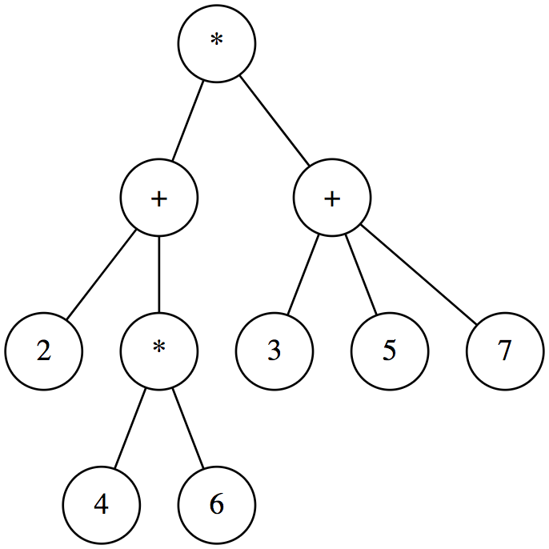

<style type="text/css">
html, body, div, p { font-family: Helvetica; }
</style>


---


---

<https://repl.it/languages/scheme>

---

# Github хранилище с материалите от семинара

1. <https://github.com/triffon/fp-2021-22>

1. Отивате в `exercises/8`

---

Всеки мощен език за програмиране ни дава 3 основни средства за организация на нашите идеи при решаването на даден проблем:

- **примитивни изрази** – най-простите елементи
- **средства за комбинация** – за създаване на съставни елементи от по-прости
- **средства за абстракция** – за именуване на съставни елементи, които да използваме като примитивните елементи

---

# Израз

Infix notation

```
1 + 2
```

Prefix notation

```scheme
(+ 1 2)
(+ 1 2 3 4 5) ; повече аргументи
```

---

# Атоми

## Примитивните изрази в езика

```scheme
42
3.14
#t
#f
```

---


---

# Списъци

## Средствата за комбинация в езика

```scheme
(operation operand1 operand2 ...)
```

```scheme
(sum-of-squares 2 3)
```

```scheme
(+ (* 2 2) (* 3 3))
```

---

# Вградени процедури

## Te също са изрази

`+`, `-`, `*`, `/`, `remainder`, `quotient`, `modulo`

---

# Вградени предикати

## Те също са процедури

`=`, `<`, `>`, `<=`, `>=`, `not`, `and`, `or`

---

“Lisp programmers know the value
of everything but the cost of nothing.”
--

*<div style="text-align: right">Alan Perlis
(paraphrasing Oscar Wilde)</div>*

---

# Оценка на комбинация

`(подизраз1 подизраз2 подизраз3 ...)`

1. Оценяваме всички под-изрази в комбинацията (списъка).

`(процедура аргумент1 аргумент2 ...)`

2. Прилагаме стойността на най-левия подизраз (`процедура`) върху аргументите, които са стойностите на останалите подизрази.

---

# Оценете комбинацията

```scheme
(* (+ 2 (* 4 6))
   (+ 3 5 7))
```

---



---


---

# Именуване на израз

## Средство за абстракция

```scheme
(define grade 6)
```

```scheme
(define answer
  (+ 3
     (* 3 13)))
```

```scheme
(define + -)
```

---

# Дефиниране на процедура

## По-мощно средство за абстракция


<br>

```scheme
(define (sum-of-squares x y)
  (+ (square x) (square y)))
```

---

# Прилагане на процедура

```scheme
(square 7) ; 49
```

```scheme
(sum-of-squares 3 4) ; 25
```

```scheme
(sum-of-squares (+ 1 2) (* 2 2)) ; 25
```

---

# if

```scheme
(if (= 1 1) #t #f) ; #t
```

```scheme
(if (not (= 1 1))
    (+ 3 3)
    (+ 1 1)) ; 2
```

```scheme
(if <условие>
    <истина>
    <лъжа>)
```

---

# cond

```scheme
(define (abs x)
  (cond ((> x 0) x)
        ((< x 0) (- x))
        (else 0)))
```

```scheme
(cond (<условие-1> <клауза-1>)
      (<условие-2> <клауза-2>)
      ...
      (<условие-N> <клауза-N>)
      (else <клауза-по-подразбиране>))
```

---

# Логически оператори

```scheme
(and <p1> <p2> ... <pN>)
```

```scheme
(or <p1> <p2> ... <pN>)
```

```scheme
(not <p>)
```

### Примери

```scheme
(define (>= x y) (or (> x y) (= x y)))

(define (>= x y) (not (< x y)))
```
