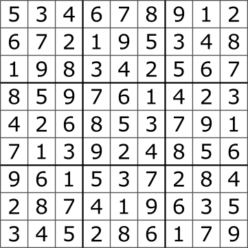

# Първо домашно по ФП

**Срок:** 24 ноември, 17:00

> В текущата директория има по един файл с unit тестове за всяка задача. Решенията си пишете в тези файлове и ги предайте в zip архив в мудъл.
#### [Сваляне на файловете](https://download-directory.github.io/?url=https%3A%2F%2Fgithub.com%2Ftriffon%2Ffp-2021-22%2Ftree%2Fmaster%2Fhomeworks%2F1-scheme)

### [Зад 1][p1] (2т.)
Функция `automorphic?`, която намира дали дадено число е автоморфно,
тоест дали квадратът му завършва на него.

```scheme
(automorphic? 6) -> #t  ; 6^2  = 36
(automorphic? 5) -> #t  ; 5^2  = 25

(automorphic? 4) -> #f  ; 4^2  = 16
(automorphic? 11) -> #f ; 11^2 = 121
```

### [Зад 2][p2] (4т.)
Функция `count-pairs-gcd`, която намира броят на наредените двойки от цели числа
от интервала [a,b], които имат най-голям общ делител равен на `n`.

### [Зад 3][p3] (4т.)
Функция `min-duplicate`, която по списък от числа намира най-малкото число,
което се среща поне 2 пъти в списъка.

```scheme
(min-duplicate '(1 2 3 8 3 3 6 6 8 4)) -> 3
```

### [Зад 4][p4] (5т.)
Функция `sudoku-solved?`, която приема поле с размер 9x9 и намира
дали полето изпълнява правилата на судоку. Правилата са на всеки ред, колона и
всички 3x3 подполета да съдържат точно всички цифри от 1 до 9 без повторения.

Подполетата са 9 на брой, образуват разбиване на полето (тоест не се припокриват и
обединението им е цялото поле) и винаги започват в ред и колона кратни на 3,
както се вижда на картинката:



Полето се подава като първи аргумент на `sudoku-solved?` във вид на списък от редове.
За горната картинка, полето се представя като:

```scheme
'((5 3 4  6 7 8  9 1 2)
  (6 7 2  1 9 5  3 4 8)
  (1 9 8  3 4 2  5 6 7)

  (8 5 9  7 6 1  4 2 3)
  (4 2 6  8 5 3  7 9 1)
  (7 1 3  9 2 4  8 5 6)

  (9 6 1  5 3 7  2 8 4)
  (2 8 7  4 1 9  6 3 5)
  (3 4 5  2 8 6  1 7 9))
```
За това поле се очаква `sudoku-solved?` да върне `#t`.

А за неправилно поле, например:
```scheme
'((5 3 4  6 7 8  9 1 2)
  (6 5 2  1 9 7  3 4 8)
  (1 9 8  3 4 2  5 6 7)

  (8 5 9  7 6 1  4 2 3)
  (4 2 6  8 5 3  7 9 1)
  (7 1 3  9 2 4  8 5 6)

  (9 6 1  5 3 7  2 8 4)
  (2 8 7  4 1 9  6 3 5)
  (3 4 5  2 8 6  1 7 9))
```
се очаква `sudoku-solved?` да върне `#f`, тъй като в първото подполе се среща два пъти `5`.


[p1]: ./01.automorphic.rkt
[p2]: ./02.count-pairs-gcd.rkt
[p3]: ./03.min-duplicate.rkt
[p4]: ./04.sudoku.rkt
